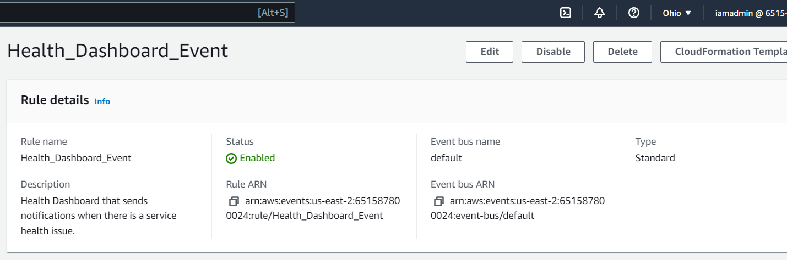
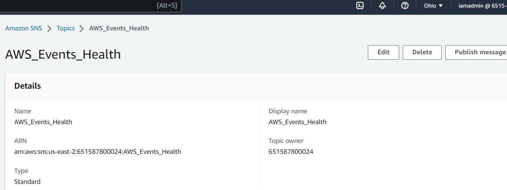

# Week 0 — Billing and Architecture

## Required Homework

### Installing AWS CLI

I already had the AWS CLI installed on my local environment where I got the documentation from the [AWS Install Guide](https://docs.aws.amazon.com/cli/latest/userguide/getting-started-install.html)
I Downloaded and run the AWS CLI MSI installer for Windows (64-bit) as provided in the guide and then setup my AWS environment.
```
https://awscli.amazonaws.com/AWSCLIV2.msi
```


### Create a budget
I created a $10 budget as that's all I am able to spare for the month for this particular bootcamp.


### Create a billing alarm
I also created a billing alarm just to show that there are different ways of tracking my spend and I made a $10 one as well.


### Recreate Logical Conceptual Design


[Lucid Logical Design Chart](https://lucid.app/lucidchart/e96ce944-5723-4acf-9a0a-125b96c06477/edit?viewport_loc=-4450%2C59%2C2404%2C1174%2C0_0&invitationId=inv_f2342884-d436-479b-b8db-dc83ec828d76)

### Recreate Logical Architectural Design

[Lucid Architectural Design Chart](https://lucid.app/lucidchart/d7fd98be-89b3-4a0e-8d29-f9348ea2b130/edit?view_items=yT_wtKpkI4to&invitationId=inv_cd0daa28-6bc0-4ef7-992e-9dc0ac126b1d)

## Homework Challenges

### Using EventBridge to hookup Health Dashboard to SNS to send notifications

As an added homework challenge I used EventBridge to hookup the health Dashboard which would then send me a notification whenever there is a health event on my primary location. 
I used the [AWS CloudWatch Events Guide](https://docs.aws.amazon.com/health/latest/ug/cloudwatch-events-health.html) to create an EventrBridge rule and the used SNS as the medium to which I would receive the notifications.


I then had to create an SNS topic and subscribe in order to receice any notifications whenever there is any changes to the dashboard.



