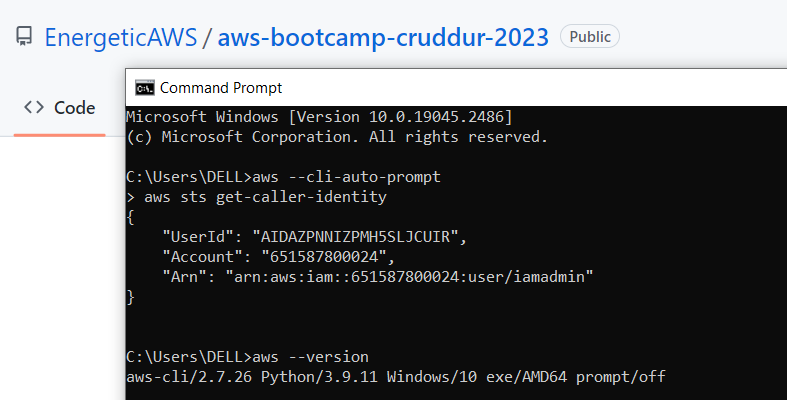

# Week 0 — Billing and Architecture

## Required Homework

### Installing AWS CLI

I already had the AWS CLI installed on my local environment where I got the documentation from the [AWS Install Guide](https://docs.aws.amazon.com/cli/latest/userguide/getting-started-install.html)
I Downloaded and run the AWS CLI MSI installer for Windows (64-bit) as provided in the guide and then setup my AWS environment.
```
https://awscli.amazonaws.com/AWSCLIV2.msi
```


### Create a budget
I created a $10 budget as that's all I am able to spare for the month for this particular bootcamp.


### Create a billing alarm
I also created a billing alarm just to show that there are different ways of tracking my spend and I made a $10 one as well.


### Recreate Logical Conceptual Design


[Lucid Logical Design Chart](https://lucid.app/lucidchart/e96ce944-5723-4acf-9a0a-125b96c06477/edit?viewport_loc=-4450%2C59%2C2404%2C1174%2C0_0&invitationId=inv_f2342884-d436-479b-b8db-dc83ec828d76)

## Homework Challenges
