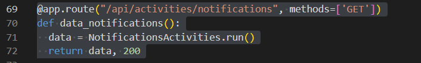
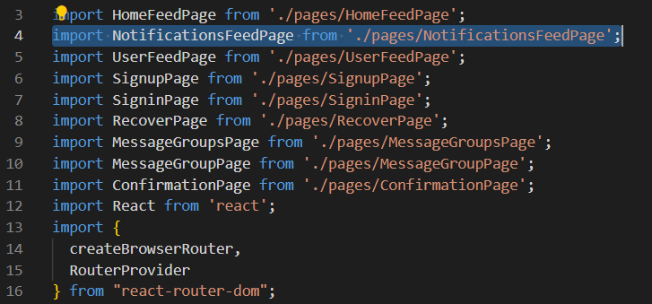
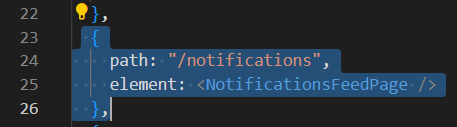
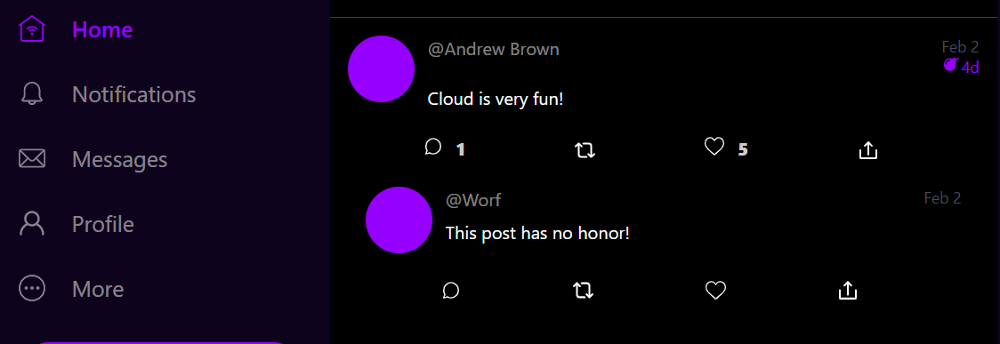
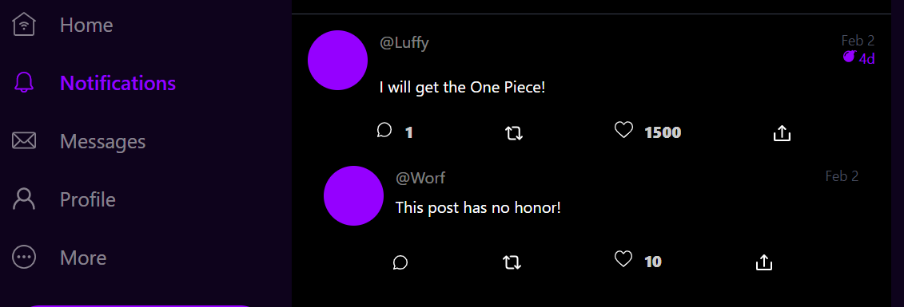

# Week 1 — App Containerization

Week 1's class was all about setting up our docker environment to a state where we could launch the Cruddur locally.
## Containerize Backend

### Add Dockerfile

First step was to create a dockerfile in the backend-flask dropdown and then paste the following code in it.

```dockerfile
FROM python:3.10-slim-buster

WORKDIR /backend-flask

COPY requirements.txt requirements.txt
RUN pip3 install -r requirements.txt

COPY . .

ENV FLASK_ENV=development

EXPOSE ${PORT}
CMD [ "python3", "-m" , "flask", "run", "--host=0.0.0.0", "--port=4567"]
```


### Running python
On the terminal type in the following code in order to install the python libraries used for the app.
```
cd backend-flask/
pip3 install -r requirements.txt
```
### Build Container

```sh
docker build -t  backend-flask ./backend-flask
```

### Run Container

Run the following commands 
```sh
docker run --rm -p 4567:4567 -it -e FRONTEND_URL='*' -e BACKEND_URL='*' backend-flask
```
Make sure you unlock the 4567 port to the public as well as open the link for 4567 in your browser and append to the url to `/api/activities/home`


## Containerize Frontend

### Run NPM Install

We have to run NPM Install before building the container since it needs to copy the contents of node_modules

```
cd frontend-react-js
npm i
```
While that is running we go ahead and create a new `Dockerfile` in the frontend directory and then paste in the commands below


Create a file here: `frontend-react-js/Dockerfile`

```dockerfile
FROM node:16.18

ENV PORT=3000

COPY . /frontend-react-js
WORKDIR /frontend-react-js
RUN npm install
EXPOSE ${PORT}
CMD ["npm", "start"]
```
## Multiple Containers
In order to run multiple containers we are going to create a Docker-compose file which will enable us to run multiple containers instead of having to do it manually.

### Create a docker-compose file

Create `docker-compose.yml` at the root of your project.

```yaml
version: "3.8"
services:
  backend-flask:
    environment:
      FRONTEND_URL: "https://3000-${GITPOD_WORKSPACE_ID}.${GITPOD_WORKSPACE_CLUSTER_HOST}"
      BACKEND_URL: "https://4567-${GITPOD_WORKSPACE_ID}.${GITPOD_WORKSPACE_CLUSTER_HOST}"
    build: ./backend-flask
    ports:
      - "4567:4567"
    volumes:
      - ./backend-flask:/backend-flask
  frontend-react-js:
    environment:
      REACT_APP_BACKEND_URL: "https://4567-${GITPOD_WORKSPACE_ID}.${GITPOD_WORKSPACE_CLUSTER_HOST}"
    build: ./frontend-react-js
    ports:
      - "3000:3000"
    volumes:
      - ./frontend-react-js:/frontend-react-js

# the name flag is a hack to change the default prepend folder
# name when outputting the image names
networks: 
  internal-network:
    driver: bridge
    name: cruddur
```

In order to test it we can right-click on the docker-compose on the right and select up and it should configure the environment variables for us as well as install all the dependancies we need.

On the ports tab we should see that both `port 3000 and port 4567` are highlited and that they are both open to the public.


We then click on the address associated with the port 3000 and it should open the home page of our cruddur app


## Create the notification feature

### Backend

On the cruddur app I went ahead and signed up and logged in using the hard coded confirmation code


Back on gitpod on the openapi yaml file I included the notification api lines of code in order to add them.
```
/api/activities/notifications:
    get:
      description: 'Return a feed of activity for all those that I follow'
      tags:
        - activities
      parameters: []
      responses:
        '200':
          description: Returns an array of activities
          content:
            application/json:
              schema:
                type: array
                items:
                  $ref: '#/components/schemas/Activity'
```

Next on the app.py file 
I included the notifications service so that it gets imported whenever the app is run 
```
from services.notifications_activities import *
```
![Notification service code]{assets/Week_1_notification.PNG}

I then added theses additional lines of code in order to add the notification activites
```
@app.route("/api/activities/notifications", methods=['GET'])
def data_notifications():
  data = NotificationsActivities.run()
  return data, 200
  ```


Then I created the notifications_activites.py and pasted the following code
```
from datetime import datetime, timedelta, timezone
class NotificationsActivities:
  def run():
    now = datetime.now(timezone.utc).astimezone()
    results = [{
      'uuid': '68f126b0-1ceb-4a33-88be-d90fa7109eee',
      'handle':  'Luffy',
      'message': 'I will get the One Piece!',
      'created_at': (now - timedelta(days=2)).isoformat(),
      'expires_at': (now + timedelta(days=5)).isoformat(),
      'likes_count': 1500,
      'replies_count': 1,
      'reposts_count': 0,
      'replies': [{
        'uuid': '26e12864-1c26-5c3a-9658-97a10f8fea67',
        'reply_to_activity_uuid': '68f126b0-1ceb-4a33-88be-d90fa7109eee',
        'handle':  'Worf',
        'message': 'This post has no honor!',
        'likes_count': 10,
        'replies_count': 0,
        'reposts_count': 0,
        'created_at': (now - timedelta(days=2)).isoformat()
      }],
    },
    ]
    return results
 ```  
It resembles the home page as the structure is basically the same and that's why it was easy to copy from the home activity file and change it to the notification activities

### Frontend

On the App.js file I then added the notifications tab route
 ```
import NotificationsFeedPage from './pages/NotificationsFeedPage';
 ```
 
 
 Then I added the path to the notifications 
  ```
  {
    path: "/notifications",
    element: <NotificationsFeedPage />
  },
 ```
 
 
 Next under pages I went ahead and created the `NotificationFeedPage.js` and `NotificationFeedPage.css` file
``` 
import './NotificationsFeedPage.css';
import React from "react";

import DesktopNavigation  from '../components/DesktopNavigation';
import DesktopSidebar     from '../components/DesktopSidebar';
import ActivityFeed from '../components/ActivityFeed';
import ActivityForm from '../components/ActivityForm';
import ReplyForm from '../components/ReplyForm';

// [TODO] Authenication
import Cookies from 'js-cookie'

export default function HomeFeedPage() {
  const [activities, setActivities] = React.useState([]);
  const [popped, setPopped] = React.useState(false);
  const [poppedReply, setPoppedReply] = React.useState(false);
  const [replyActivity, setReplyActivity] = React.useState({});
  const [user, setUser] = React.useState(null);
  const dataFetchedRef = React.useRef(false);

  const loadData = async () => {
    try {
      const backend_url = `${process.env.REACT_APP_BACKEND_URL}/api/activities/notifications`
      const res = await fetch(backend_url, {
        method: "GET"
      });
      let resJson = await res.json();
      if (res.status === 200) {
        setActivities(resJson)
      } else {
        console.log(res)
      }
    } catch (err) {
      console.log(err);
    }
  };

  const checkAuth = async () => {
    console.log('checkAuth')
    // [TODO] Authenication
    if (Cookies.get('user.logged_in')) {
      setUser({
        display_name: Cookies.get('user.name'),
        handle: Cookies.get('user.username')
      })
    }
  };

  React.useEffect(()=>{
    //prevents double call
    if (dataFetchedRef.current) return;
    dataFetchedRef.current = true;

    loadData();
    checkAuth();
  }, [])

  return (
    <article>
      <DesktopNavigation user={user} active={'home'} setPopped={setPopped} />
      <div className='content'>
        <ActivityForm  
          popped={popped}
          setPopped={setPopped} 
          setActivities={setActivities} 
        />
        <ReplyForm 
          activity={replyActivity} 
          popped={poppedReply} 
          setPopped={setPoppedReply} 
          setActivities={setActivities} 
          activities={activities} 
        />
        <ActivityFeed 
          title="Home" 
          setReplyActivity={setReplyActivity} 
          setPopped={setPoppedReply} 
          activities={activities} 
        />
      </div>
      <DesktopSidebar user={user} />
    </article>
  );
}
```
All that is left is to confirm that it works

First the homepage


Then the notifiactions page which I have created



