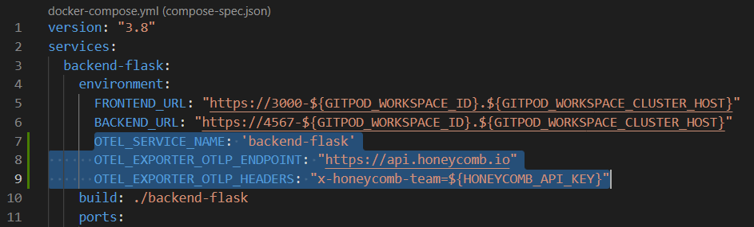
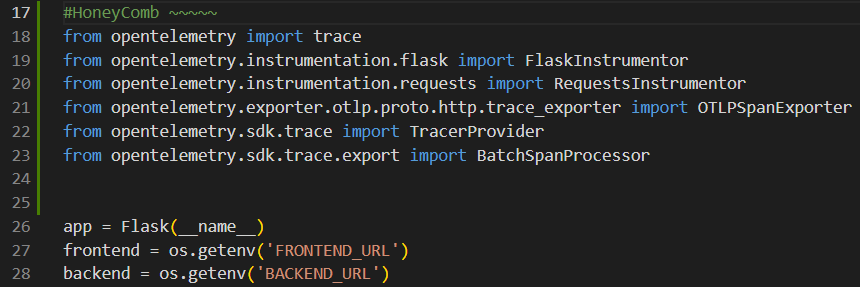
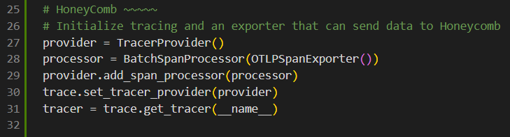
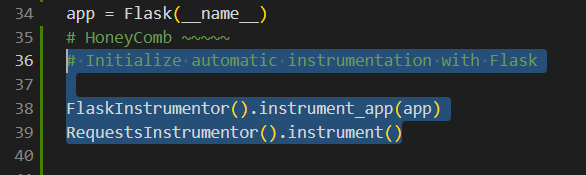

# Week 2 — Distributed Tracing

## Honeycomb

### Creating a new dataset in Honeycomb 
I  got the API key from my honeycomb account and then exported it to my gitpod using the code below:
```
export HONEYCOMB_API_KEY=""
gp env HONEYCOMB_API_KEY=""
export HONEYCOMB_SERVICE_NAME="Cruddur"
gp env HONEYCOMB_SERVICE_NAME="Cruddur"

```
I also added the open telemetry code that will send data to honeycomb
```
OTEL_EXPORTER_OTLP_ENDPOINT: "https://api.honeycomb.io"
OTEL_EXPORTER_OTLP_HEADERS: "x-honeycomb-team=${HONEYCOMB_API_KEY}"
OTEL_SERVICE_NAME: "${HONEYCOMB_SERVICE_NAME}"
```


### App.py updates
```
from opentelemetry import trace
from opentelemetry.instrumentation.flask import FlaskInstrumentor
from opentelemetry.instrumentation.requests import RequestsInstrumentor
from opentelemetry.exporter.otlp.proto.http.trace_exporter import OTLPSpanExporter
from opentelemetry.sdk.trace import TracerProvider
from opentelemetry.sdk.trace.export import BatchSpanProcessor
```


### Initializing tracing and an exporter that can send data to Honeycomb
```
provider = TracerProvider()
processor = BatchSpanProcessor(OTLPSpanExporter())
provider.add_span_processor(processor)
trace.set_tracer_provider(provider)
tracer = trace.get_tracer(__name__)
```


### Initialize automatic instrumentation with Flask
```
FlaskInstrumentor().instrument_app(app)
RequestsInstrumentor().instrument()
```

