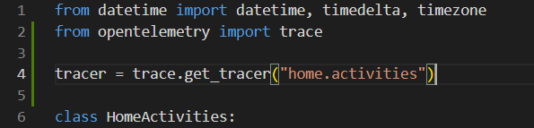
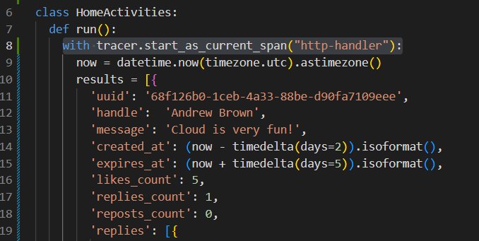
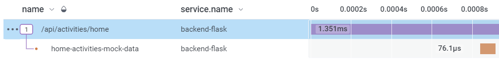
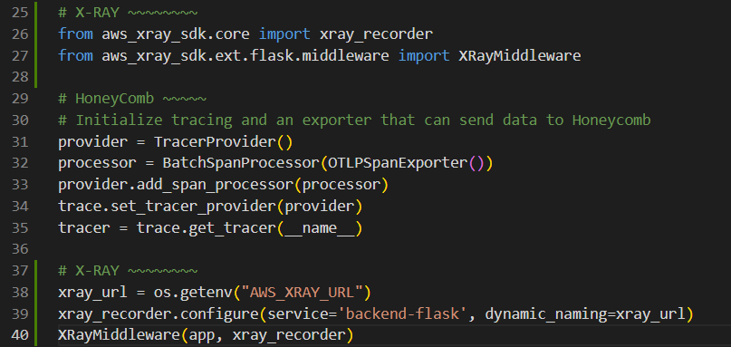
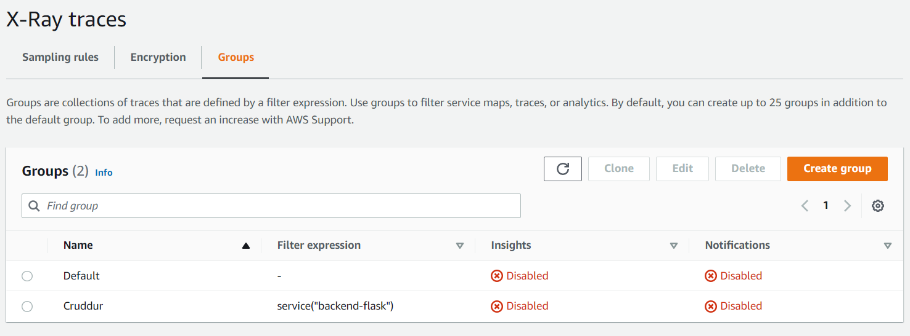
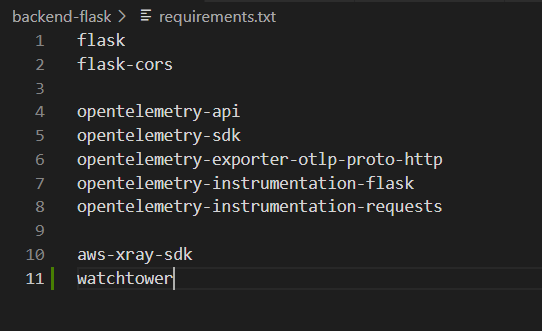
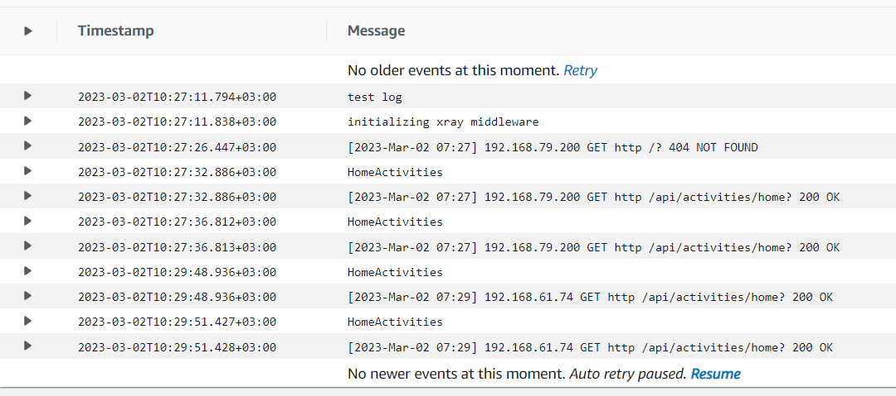
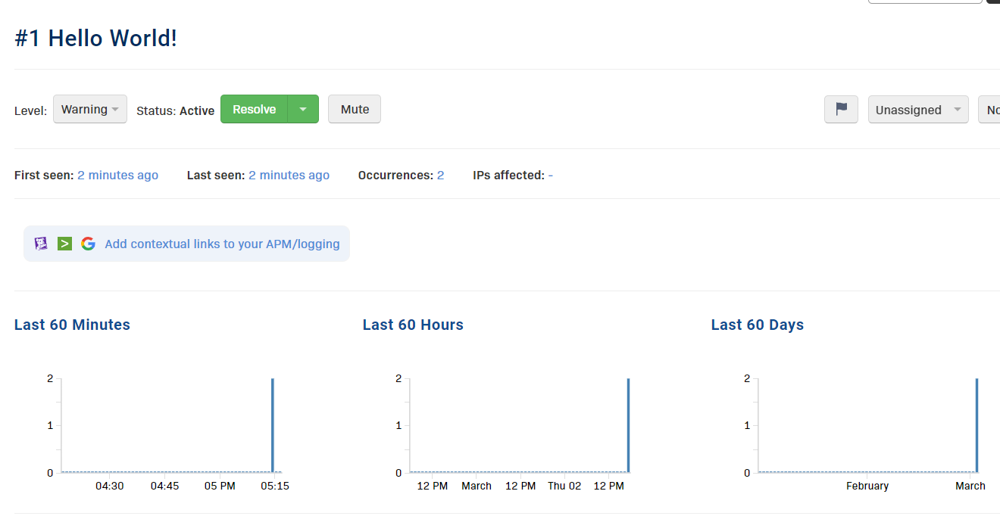

# Week 2 — Distributed Tracing

## Honeycomb

### Creating a new dataset in Honeycomb 
I  got the API key from my honeycomb account and then exported it to my gitpod using the code below:
```
export HONEYCOMB_API_KEY=""
gp env HONEYCOMB_API_KEY=""
export HONEYCOMB_SERVICE_NAME="Cruddur"
gp env HONEYCOMB_SERVICE_NAME="Cruddur"

```
I also added the open telemetry code that will send data to honeycomb
```
OTEL_EXPORTER_OTLP_ENDPOINT: "https://api.honeycomb.io"
OTEL_EXPORTER_OTLP_HEADERS: "x-honeycomb-team=${HONEYCOMB_API_KEY}"
OTEL_SERVICE_NAME: "${HONEYCOMB_SERVICE_NAME}"
```


### App.py updates
```
from opentelemetry import trace
from opentelemetry.instrumentation.flask import FlaskInstrumentor
from opentelemetry.instrumentation.requests import RequestsInstrumentor
from opentelemetry.exporter.otlp.proto.http.trace_exporter import OTLPSpanExporter
from opentelemetry.sdk.trace import TracerProvider
from opentelemetry.sdk.trace.export import BatchSpanProcessor
```


### Initializing tracing and an exporter that can send data to Honeycomb
```
provider = TracerProvider()
processor = BatchSpanProcessor(OTLPSpanExporter())
provider.add_span_processor(processor)
trace.set_tracer_provider(provider)
tracer = trace.get_tracer(__name__)
```


### Initialize automatic instrumentation with Flask
```
FlaskInstrumentor().instrument_app(app)
RequestsInstrumentor().instrument()
```


### Hardcoding a span

On the home_activities python file I included the following code:
```
from opentelemetry import trace

tracer = trace.get_tracer("tracer.name.here")

```


### Creating spans

`with tracer.start_as_current_span("http-handler"):`



## Honeycomb

Back in honeycomb on the recent traces I saw the newly created spans



## AWS xray
```
from aws_xray_sdk.core import xray_recorder
from aws_xray_sdk.ext.flask.middleware import XRayMiddleware

xray_url = os.getenv("AWS_XRAY_URL")
xray_recorder.configure(service='Cruddur', dynamic_naming=xray_url)
XRayMiddleware(app, xray_recorder)
```


### Setting up sampling rules
I created a new json file named `xray.json` under the aws direcotry and pasted in the code below
```
{
  "SamplingRule": {
      "RuleName": "Cruddur",
      "ResourceARN": "*",
      "Priority": 9000,
      "FixedRate": 0.1,
      "ReservoirSize": 5,
      "ServiceName": "backend-flask",
      "ServiceType": "*",
      "Host": "*",
      "HTTPMethod": "*",
      "URLPath": "*",
      "Version": 1
  }
}
```

### Creaating a group
On the aws cli terminal on the backend-flask directory.
```
FLASK_ADDRESS="https://4567-${GITPOD_WORKSPACE_ID}.${GITPOD_WORKSPACE_CLUSTER_HOST}"
aws xray create-group \
   --group-name "Cruddur" \
   --filter-expression "service(\"backend-flask\")"
```
On the AWS console on the xray groups menu I saw my newly created group



### Adding Deamon Service to Docker Compose
```
  xray-daemon:
    image: "amazon/aws-xray-daemon"
    environment:
      AWS_ACCESS_KEY_ID: "${AWS_ACCESS_KEY_ID}"
      AWS_SECRET_ACCESS_KEY: "${AWS_SECRET_ACCESS_KEY}"
      AWS_REGION: "us-east-1"
    command:
      - "xray -o -b xray-daemon:2000"
    ports:
      - 2000:2000/udp
```
Next I added these two env vars to our backend-flask in our `docker-compose.yml` file
```
AWS_XRAY_URL: "*4567-${GITPOD_WORKSPACE_ID}.${GITPOD_WORKSPACE_CLUSTER_HOST}*"
AWS_XRAY_DAEMON_ADDRESS: "xray-daemon:2000"
```
### Cloudwatch Logs

I added `watchtower ` to the requirements.txt 



in the app.py
```
import watchtower
import logging
from time import strftime
```
```
# Configuring Logger to Use CloudWatch
LOGGER = logging.getLogger(__name__)
LOGGER.setLevel(logging.DEBUG)
console_handler = logging.StreamHandler()
cw_handler = watchtower.CloudWatchLogHandler(log_group='cruddur')
LOGGER.addHandler(console_handler)
LOGGER.addHandler(cw_handler)
```
For error logging
```
@app.after_request
def after_request(response):
    timestamp = strftime('[%Y-%b-%d %H:%M]')
    LOGGER.error('%s %s %s %s %s %s', timestamp, request.remote_addr, request.method, request.scheme, request.full_path, response.status)
    return response
```
Setting the env var in the backend-flask for docker-compose.yml
```
      AWS_DEFAULT_REGION: "${AWS_DEFAULT_REGION}"
      AWS_ACCESS_KEY_ID: "${AWS_ACCESS_KEY_ID}"
      AWS_SECRET_ACCESS_KEY: "${AWS_SECRET_ACCESS_KEY}"
```
On the `home_activities.py` file
```
class HomeActivities:
  def run(logger):
    logger.info("HomeActivities")
```

On the `app.py` file
```
@app.route("/api/activities/home", methods=['GET'])
def data_home():
  data = HomeActivities.run(logger=LOGGER)
  return data, 200
```
On the AWS console on the Cloudwatch Logs 



### Rollbar
Add to requirements.txt
```
blinker
rollbar
```
Setting access token
```
export ROLLBAR_ACCESS_TOKEN=""
gp env ROLLBAR_ACCESS_TOKEN=""
```
Import for Rollbar
```
import rollbar
import rollbar.contrib.flask
from flask import got_request_exception
```
```
rollbar_access_token = os.getenv('ROLLBAR_ACCESS_TOKEN')
@app.before_first_request
def init_rollbar():
    """init rollbar module"""
    rollbar.init(
        # access token
        rollbar_access_token,
        # environment name
        'production',
        # server root directory, makes tracebacks prettier
        root=os.path.dirname(os.path.realpath(__file__)),
        # flask already sets up logging
        allow_logging_basic_config=False)

    # send exceptions from `app` to rollbar, using flask's signal system.
    got_request_exception.connect(rollbar.contrib.flask.report_exception, app)
 ```
Added an endpoint just for testing rollbar to app.py
```
@app.route('/rollbar/test')
def rollbar_test():
    rollbar.report_message('Hello World!', 'warning')
    return "Hello World!"
```


