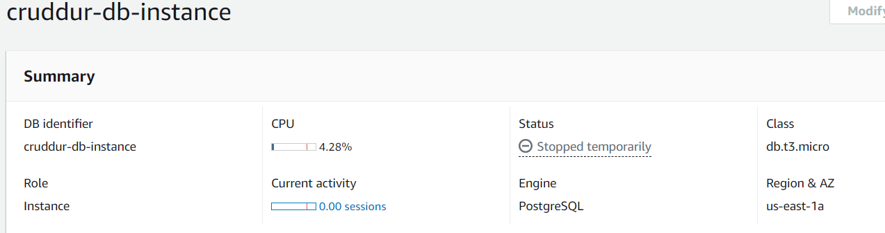

# Week 4 — Postgres and RDS

### Provisioning a RDS Instance
```
aws rds create-db-instance \
  --db-instance-identifier cruddur-db-instance \
  --db-instance-class db.t3.micro \
  --engine postgres \
  --engine-version  14.6 \
  --master-username root \
  --master-user-password *********** \
  --allocated-storage 20 \
  --availability-zone us-east-1a \
  --backup-retention-period 0 \
  --port 5432 \
  --no-multi-az \
  --db-name cruddur \
  --storage-type gp2 \
  --publicly-accessible \
  --storage-encrypted \
  --enable-performance-insights \
  --performance-insights-retention-period 7 \
  --no-deletion-protection
  ```
After provisioning  I made sure to temporarily stop the RDS instance in order to prevent additional charges since I'm not currently using it.
  

  
### Postgres
To connect to psql via the psql client cli tool
```
psql -Upostgres --host localhost
```
### Creating a database
I can create the database within the PSQL client

```
CREATE database cruddur;
```
### Import Script
I created a new SQL file called schema.sql and placed it in backend-flask/db then pasted in the UUID extension
```
CREATE EXTENSION IF NOT EXISTS "uuid-ossp";
```
### Shell Script to Connect to DB
For things I commonly need to do I created a new directory called `bin`

I created an new folder called `bin` to hold all my bash scripts.

 I created a new bash script `bin/db-connect`
 
 ```
 #! /usr/bin/bash
CYAN='\033[1;36m'
NO_COLOR='\033[0m'

if [ "$1" = "prod" ]; then
  echo "Running in production mode"
  URL=$PROD_CONNECTION_URL
else
  URL=$CONNECTION_URL
fi

psql $URL
 ```
### Shell script to drop the database
 I created a new bash script `bin/db-drop`
 
 ```
 #! /usr/bin/bash

CYAN='\033[1;36m'
NO_COLOR='\033[0m'
LABEL="db-drop"
printf "${CYAN}== ${LABEL}${NO_COLOR}\n"

NO_DB_CONNECTION_URL=$(sed 's/\/cruddur//g' <<<"$CONNECTION_URL")
psql $NO_DB_CONNECTION_URL -c "drop database cruddur;"
```
### Shell script to create the database
I created a new bash script `bin/db-create`

```
#! /usr/bin/bash

CYAN='\033[1;36m'
NO_COLOR='\033[0m'
LABEL="db-create"
printf "${CYAN}== ${LABEL}${NO_COLOR}\n"

NO_DB_CONNECTION_URL=$(sed 's/\/cruddur//g' <<<"$CONNECTION_URL")
psql $NO_DB_CONNECTION_URL -c "create database cruddur;"
```
### Shell script to load the schema
 I created a new bash script `bin/db-schema-load`
 ```
 #! /usr/bin/bash
CYAN='\033[1;36m'
NO_COLOR='\033[0m'
LABEL="db-schema-load"
printf "${CYAN}== ${LABEL}${NO_COLOR}\n"

echo "db-schema-load"

schema_path="$(realpath .)/db/schema.sql"
echo $schema_path

if [ "$1" = "prod" ]; then
  echo "Running in production mode"
  URL=$PROD_CONNECTION_URL
else
  URL=$CONNECTION_URL
fi

psql $URL cruddur < $schema_path
```
### Shell script to load the seed
 I created a new bash script `bin/db-sessions`
 ```
 #! /usr/bin/bash

CYAN='\033[1;36m'
NO_COLOR='\033[0m'
LABEL="db-seed"
printf "${CYAN}== ${LABEL}${NO_COLOR}\n"

seed_path="$(realpath .)/db/seed.sql"
echo $seed_path

if [ "$1" = "prod" ]; then
  echo "Running in production mode"
  URL=$PROD_CONNECTION_URL
else
  URL=$CONNECTION_URL
fi

psql $URL cruddur < $seed_path
```
 
### Shell script to load the session information
 I created a new bash script `bin/db-sessions`
 ```
 #! /usr/bin/bash
CYAN='\033[1;36m'
NO_COLOR='\033[0m'
LABEL="db-sessions"
printf "${CYAN}== ${LABEL}${NO_COLOR}\n"

if [ "$1" = "prod" ]; then
  echo "Running in production mode"
  URL=$PROD_CONNECTION_URL
else
  URL=$CONNECTION_URL
fi

NO_DB_URL=$(sed 's/\/cruddur//g' <<<"$URL")
psql $NO_DB_URL -c "select pid as process_id, \
       usename as user,  \
       datname as db, \
       client_addr, \
       application_name as app,\
       state \
from pg_stat_activity;"
```
### Shell script to load the setup
I created a new bash script `bin/db-setup`
```
#! /usr/bin/bash
-e # stop if it fails at any point

CYAN='\033[1;36m'
NO_COLOR='\033[0m'
LABEL="db-setup"
printf "${CYAN}==== ${LABEL}${NO_COLOR}\n"

bin_path="$(realpath .)/bin"

source "$bin_path/db-drop"
source "$bin_path/db-create"
source "$bin_path/db-schema-load"
source "$bin_path/db-seed"
```
### DB Connection Pool
First on the `requirements.txt` I added the following:
```
psycopg[binary]
psycopg[pool]
```
Then under `lib` I created the `db.py` file
```
from psycopg_pool import ConnectionPool
import os
import re
import sys
from flask import current_app as app

class Db:
  def __init__(self):
    self.init_pool()

  def template(self,*args):
    pathing = list((app.root_path,'db','sql',) + args)
    pathing[-1] = pathing[-1] + ".sql"

    template_path = os.path.join(*pathing)

    green = '\033[92m'
    no_color = '\033[0m'
    print("\n")
    print(f'{green} Load SQL Template: {template_path} {no_color}')

    with open(template_path, 'r') as f:
      template_content = f.read()
    return template_content

  def init_pool(self):
    connection_url = os.getenv("CONNECTION_URL")
    self.pool = ConnectionPool(connection_url)
  # we want to commit data such as an insert
  # be sure to check for RETURNING in all uppercases
  def print_params(self,params):
    blue = '\033[94m'
    no_color = '\033[0m'
    print(f'{blue} SQL Params:{no_color}')
    for key, value in params.items():
      print(key, ":", value)

  def print_sql(self,title,sql):
    cyan = '\033[96m'
    no_color = '\033[0m'
    print(f'{cyan} SQL STATEMENT-[{title}]------{no_color}')
    print(sql)
  def query_commit(self,sql,params={}):
    self.print_sql('commit with returning',sql)

    pattern = r"\bRETURNING\b"
    is_returning_id = re.search(pattern, sql)

    try:
      with self.pool.connection() as conn:
        cur =  conn.cursor()
        cur.execute(sql,params)
        if is_returning_id:
          returning_id = cur.fetchone()[0]
        conn.commit() 
        if is_returning_id:
          return returning_id
    except Exception as err:
      self.print_sql_err(err)
  # when we want to return a json object
  def query_array_json(self,sql,params={}):
    self.print_sql('array',sql)

    wrapped_sql = self.query_wrap_array(sql)
    with self.pool.connection() as conn:
      with conn.cursor() as cur:
        cur.execute(wrapped_sql,params)
        json = cur.fetchone()
        return json[0]
  # When we want to return an array of json objects
  def query_object_json(self,sql,params={}):

    self.print_sql('json',sql)
    self.print_params(params)
    wrapped_sql = self.query_wrap_object(sql)

    with self.pool.connection() as conn:
      with conn.cursor() as cur:
        cur.execute(wrapped_sql,params)
        json = cur.fetchone()
        if json == None:
          "{}"
        else:
          return json[0]
  def query_wrap_object(self,template):
    sql = f"""
    (SELECT COALESCE(row_to_json(object_row),'{{}}'::json) FROM (
    {template}
    ) object_row);
    """
    return sql
  def query_wrap_array(self,template):
    sql = f"""
    (SELECT COALESCE(array_to_json(array_agg(row_to_json(array_row))),'[]'::json) FROM (
    {template}
    ) array_row);
    """
    return sql
  def print_sql_err(self,err):
    # get details about the exception
    err_type, err_obj, traceback = sys.exc_info()

    # get the line number when exception occured
    line_num = traceback.tb_lineno

    # print the connect() error
    print ("\npsycopg ERROR:", err, "on line number:", line_num)
    print ("psycopg traceback:", traceback, "-- type:", err_type)

    # print the pgcode and pgerror exceptions
    print ("pgerror:", err.pgerror)
    print ("pgcode:", err.pgcode, "\n")

db = Db()
```
