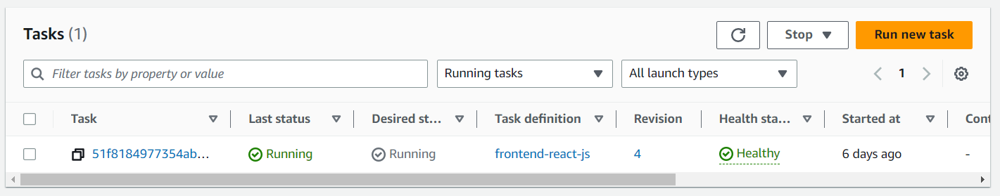
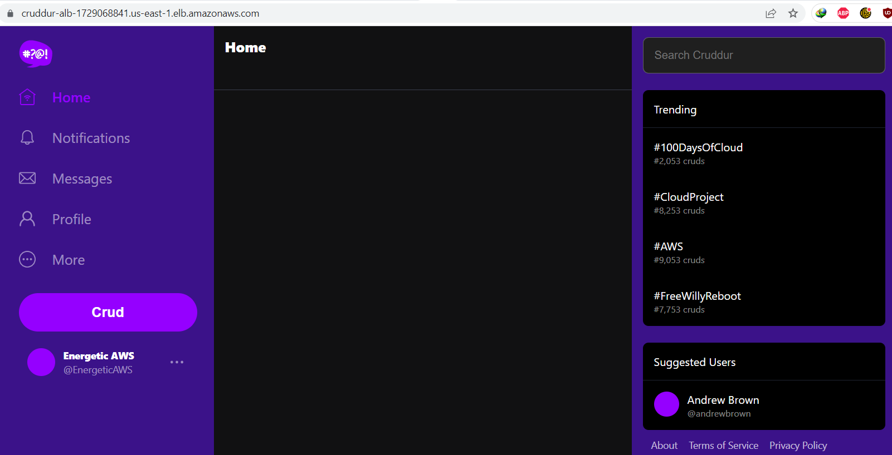
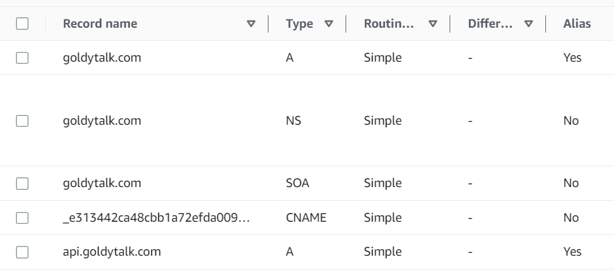
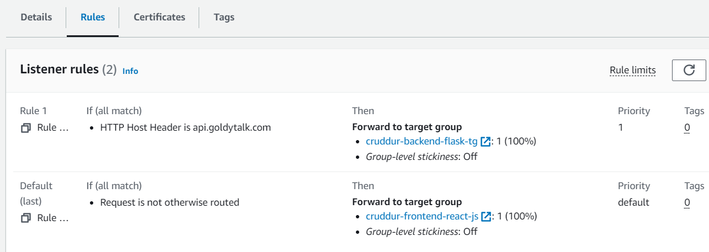

# Week 6 — Deploying Containers
## Implementing healthchecks
### Test RDS Connecetion
Under `/bin/db` I created the script to easily check our connection from our container.
```sh
#!/usr/bin/env python3

import psycopg
import os
import sys

connection_url = os.getenv("CONNECTION_URL")

conn = None
try:
  print('attempting connection')
  conn = psycopg.connect(connection_url)
  print("Connection successful!")
except psycopg.Error as e:
  print("Unable to connect to the database:", e)
finally:
  conn.close()
```
### Task Flask Script
In the `app.py` file
```
@app.route('/api/health-check')
def health_check():
  return {'success': True}, 200
```
create a new bin script at `bin/flask/health-check`
```
#!/usr/bin/env python3

import urllib.request

try:
  response = urllib.request.urlopen('http://localhost:4567/api/health-check')
  if response.getcode() == 200:
    print("[OK] Flask server is running")
    exit(0) # success
  else:
    print("[BAD] Flask server is not running")
    exit(1) # false
# This for some reason is not capturing the error....
#except ConnectionRefusedError as e:
# so we'll just catch on all even though this is a bad practice
except Exception as e:
  print(e)
  exit(1) # false
  
```

## ECS and ECR
### Creating an ECS Cluster
```
aws ecs create-cluster \
--cluster-name cruddur \
--service-connect-defaults namespace=cruddur
```
### Creating ECR repo and push image
```
aws ecr create-repository \
  --repository-name cruddur-python \
  --image-tag-mutability MUTABLE
```
### Login to ECR
`aws ecr get-login-password --region $AWS_DEFAULT_REGION | docker login --username AWS --password-stdin "$AWS_ACCOUNT_ID.dkr.ecr.$AWS_DEFAULT_REGION.amazonaws.com"`

### Set URL
```
export ECR_PYTHON_URL="$AWS_ACCOUNT_ID.dkr.ecr.$AWS_DEFAULT_REGION.amazonaws.com/cruddur-python"
echo $ECR_PYTHON_URL
```
### Pull Image
`docker pull python:3.10-slim-buster`

### Tag Image 
`docker tag python:3.10-slim-buster $ECR_PYTHON_URL:3.10-slim-buster`

### Push Image
`docker push $ECR_PYTHON_URL:3.10-slim-buster`

### For Flask
In the flask dockerfile update the from to instead of using DockerHub's python image
```
aws ecr create-repository \
  --repository-name backend-flask \
  --image-tag-mutability MUTABLE
```
### Build Image
```docker build -t backend-flask . `

### Tag Image
`docker tag backend-flask:latest $ECR_BACKEND_FLASK_URL:latest`

### Push Image
`docker push $ECR_BACKEND_FLASK_URL:latest`

## Register Task Defintions
### Passing Senstive Data to Task Defintion 
```
aws ssm put-parameter --type "SecureString" --name "/cruddur/backend-flask/AWS_ACCESS_KEY_ID" --value $AWS_ACCESS_KEY_ID
aws ssm put-parameter --type "SecureString" --name "/cruddur/backend-flask/AWS_SECRET_ACCESS_KEY" --value $AWS_SECRET_ACCESS_KEY
aws ssm put-parameter --type "SecureString" --name "/cruddur/backend-flask/CONNECTION_URL" --value $PROD_CONNECTION_URL
aws ssm put-parameter --type "SecureString" --name "/cruddur/backend-flask/ROLLBAR_ACCESS_TOKEN" --value $ROLLBAR_ACCESS_TOKEN
aws ssm put-parameter --type "SecureString" --name "/cruddur/backend-flask/OTEL_EXPORTER_OTLP_HEADERS" --value "x-honeycomb-team=$HONEYCOMB_API_KEY"
```
### Create ExecutionRole
```sh
aws iam create-role \
    --role-name CruddurServiceExecutionRole \
    --assume-role-policy-document "{
  \"Version\":\"2012-10-17\",
  \"Statement\":[{
    \"Action\":[\"sts:AssumeRole\"],
    \"Effect\":\"Allow\",
    \"Principal\":{
      \"Service\":[\"ecs-tasks.amazonaws.com\"]
    }
  }]
}"
```

### Create TaskRole
```sh
aws iam create-role \
    --role-name CruddurTaskRole \
    --assume-role-policy-document "{
  \"Version\":\"2012-10-17\",
  \"Statement\":[{
    \"Action\":[\"sts:AssumeRole\"],
    \"Effect\":\"Allow\",
    \"Principal\":{
      \"Service\":[\"ecs-tasks.amazonaws.com\"]
    }
  }]
}"
```
```sh
aws iam put-role-policy \
  --policy-name SSMAccessPolicy \
  --role-name CruddurTaskRole \
  --policy-document "{
  \"Version\":\"2012-10-17\",
  \"Statement\":[{
    \"Action\":[
      \"ssmmessages:CreateControlChannel\",
      \"ssmmessages:CreateDataChannel\",
      \"ssmmessages:OpenControlChannel\",
      \"ssmmessages:OpenDataChannel\"
    ],
    \"Effect\":\"Allow\",
    \"Resource\":\"*\"
  }]
}
"
```
`aws iam attach-role-policy --policy-arn arn:aws:iam::aws:policy/CloudWatchFullAccess --role-name CruddurTaskRole`
`aws iam attach-role-policy --policy-arn arn:aws:iam::aws:policy/AWSXRayDaemonWriteAccess --role-name CruddurTaskRole`

### Task Definitions
Under `aws/task-definitions` create a `backend-flask.json` file
```
{
  "family": "backend-flask",
  "executionRoleArn": "arn:aws:iam::*:role/CruddurServiceExecutionRole",
  "taskRoleArn": "arn:aws:iam::*:role/CruddurTaskRole",
  "networkMode": "awsvpc",
  "cpu": "256",
  "memory": "512",
  "requiresCompatibilities": [ 
    "FARGATE" 
  ],
  "containerDefinitions": [
    {
      "name": "xray",
      "image": "public.ecr.aws/xray/aws-xray-daemon" ,
      "essential": true,
      "user": "1337",
      "portMappings": [
        {
          "name": "xray",
          "containerPort": 2000,
          "protocol": "udp"
        }
      ]
    },
    {
      "name": "backend-flask",
      "image": "*.dkr.ecr.us-east-1.amazonaws.com/backend-flask",
      "essential": true,
      "healthCheck": {
        "command": [
          "CMD-SHELL",
          "python /backend-flask/bin/health-check"
        ],
        "interval": 30,
        "timeout": 5,
        "retries": 3,
        "startPeriod": 60
      },
      "portMappings": [
        {
          "name": "backend-flask",
          "containerPort": 4567,
          "protocol": "tcp", 
          "appProtocol": "http"
        }
      ],
      "logConfiguration": {
        "logDriver": "awslogs",
        "options": {
            "awslogs-group": "cruddur",
            "awslogs-region": "us-east-1",
            "awslogs-stream-prefix": "backend-flask"
        }
      },
      "environment": [
        {"name": "OTEL_SERVICE_NAME", "value": "backend-flask"},
        {"name": "OTEL_EXPORTER_OTLP_ENDPOINT", "value": "https://api.honeycomb.io"},
        {"name": "AWS_COGNITO_USER_POOL_ID", "value": "*"},
        {"name": "AWS_COGNITO_USER_POOL_CLIENT_ID", "value": "*"},
        {"name": "FRONTEND_URL", "value": "*"},
        {"name": "BACKEND_URL", "value": "*"},
        {"name": "AWS_DEFAULT_REGION", "value": "ca-central-1"}
      ],
      "secrets": [
        {"name": "AWS_ACCESS_KEY_ID"    , "valueFrom": "arn:aws:ssm:ca-central-1:*:parameter/cruddur/backend-flask/AWS_ACCESS_KEY_ID"},
        {"name": "AWS_SECRET_ACCESS_KEY", "valueFrom": "arn:aws:ssm:ca-central-1:*:parameter/cruddur/backend-flask/AWS_SECRET_ACCESS_KEY"},
        {"name": "CONNECTION_URL"       , "valueFrom": "arn:aws:ssm:ca-central-1:*:parameter/cruddur/backend-flask/CONNECTION_URL" },
        {"name": "ROLLBAR_ACCESS_TOKEN" , "valueFrom": "arn:aws:ssm:ca-central-1:*:parameter/cruddur/backend-flask/ROLLBAR_ACCESS_TOKEN" },
        {"name": "OTEL_EXPORTER_OTLP_HEADERS" , "valueFrom": "arn:aws:ssm:ca-central-1:*:parameter/cruddur/backend-flask/OTEL_EXPORTER_OTLP_HEADERS" }
      ]
    }
  ]
}
```
Under `aws/task-definitions` create a `front-flask.json` file
```
{
  "family": "frontend-react-js",
  "executionRoleArn": "arn:aws:iam::387543059434:role/CruddurServiceExecutionRole",
  "taskRoleArn": "arn:aws:iam::387543059434:role/CruddurTaskRole",
  "networkMode": "awsvpc",
  "cpu": "256",
  "memory": "512",
  "requiresCompatibilities": [ 
    "FARGATE" 
  ],
  "containerDefinitions": [
    {
      "name": "xray",
      "image": "public.ecr.aws/xray/aws-xray-daemon" ,
      "essential": true,
      "user": "1337",
      "portMappings": [
        {
          "name": "xray",
          "containerPort": 2000,
          "protocol": "udp"
        }
      ]
    },
    {
      "name": "frontend-react-js",
      "image": "387543059434.dkr.ecr.ca-central-1.amazonaws.com/frontend-react-js",
      "essential": true,
      "healthCheck": {
        "command": [
          "CMD-SHELL",
          "curl -f http://localhost:3000 || exit 1"
        ],
        "interval": 30,
        "timeout": 5,
        "retries": 3
      },
      "portMappings": [
        {
          "name": "frontend-react-js",
          "containerPort": 3000,
          "protocol": "tcp", 
          "appProtocol": "http"
        }
      ],

      "logConfiguration": {
        "logDriver": "awslogs",
        "options": {
            "awslogs-group": "cruddur",
            "awslogs-region": "ca-central-1",
            "awslogs-stream-prefix": "frontend-react-js"
        }
      }
    }
  ]
}
```
### Frontend-react prod
```
# Base Image ~~~~~~~~~~~~~~~~~~~~~~~~~~~~~~~~~~
FROM node:16.18 AS build

ARG REACT_APP_BACKEND_URL
ARG REACT_APP_AWS_PROJECT_REGION
ARG REACT_APP_AWS_COGNITO_REGION
ARG REACT_APP_AWS_USER_POOLS_ID
ARG REACT_APP_CLIENT_ID

ENV REACT_APP_BACKEND_URL=$REACT_APP_BACKEND_URL
ENV REACT_APP_AWS_PROJECT_REGION=$REACT_APP_AWS_PROJECT_REGION
ENV REACT_APP_AWS_COGNITO_REGION=$REACT_APP_AWS_COGNITO_REGION
ENV REACT_APP_AWS_USER_POOLS_ID=$REACT_APP_AWS_USER_POOLS_ID
ENV REACT_APP_CLIENT_ID=$REACT_APP_CLIENT_ID

COPY . ./frontend-react-js
WORKDIR /frontend-react-js
RUN npm install
RUN npm run build

# New Base Image ~~~~~~~~~~~~~~~~~~~~~~~~~~~~~~
FROM nginx:1.23.3-alpine

# --from build is coming from the Base Image
COPY --from=build /frontend-react-js/build /usr/share/nginx/html
COPY --from=build /frontend-react-js/nginx.conf /etc/nginx/nginx.conf

EXPOSE 3000
```
### NGINX configuration file
```
# Set the worker processes
worker_processes 1;

# Set the events module
events {
  worker_connections 1024;
}

# Set the http module
http {
  # Set the MIME types
  include /etc/nginx/mime.types;
  default_type application/octet-stream;

  # Set the log format
  log_format  main  '$remote_addr - $remote_user [$time_local] "$request" '
                    '$status $body_bytes_sent "$http_referer" '
                    '"$http_user_agent" "$http_x_forwarded_for"';

  # Set the access log
  access_log  /var/log/nginx/access.log main;

  # Set the error log
  error_log /var/log/nginx/error.log;

  # Set the server section
  server {
    # Set the listen port
    listen 3000;

    # Set the root directory for the app
    root /usr/share/nginx/html;

    # Set the default file to serve
    index index.html;

    location / {
        # First attempt to serve request as file, then
        # as directory, then fall back to redirecting to index.html
        try_files $uri $uri/ $uri.html /index.html;
    }

    # Set the error page
    error_page  404 /404.html;
    location = /404.html {
      internal;
    }

    # Set the error page for 500 errors
    error_page  500 502 503 504  /50x.html;
    location = /50x.html {
      internal;
    }
  }
}
```
### Frontend build image
```
docker build \
--build-arg REACT_APP_BACKEND_URL="https://4567-$GITPOD_WORKSPACE_ID.$GITPOD_WORKSPACE_CLUSTER_HOST" \
--build-arg REACT_APP_AWS_PROJECT_REGION="$AWS_DEFAULT_REGION" \
--build-arg REACT_APP_AWS_COGNITO_REGION="$AWS_DEFAULT_REGION" \
--build-arg REACT_APP_AWS_USER_POOLS_ID="ca-central-1_CQ4wDfnwc" \
--build-arg REACT_APP_CLIENT_ID="5b6ro31g97urk767adrbrdj1g5" \
-t frontend-react-js \
-f Dockerfile.prod \
.
```
Create Repo
```
aws ecr create-repository \
  --repository-name frontend-react-js \
  --image-tag-mutability MUTABLE
```
Set URL
```
export ECR_FRONTEND_REACT_URL="$AWS_ACCOUNT_ID.dkr.ecr.$AWS_DEFAULT_REGION.amazonaws.com/frontend-react-js"
echo $ECR_FRONTEND_REACT_URL
```
Tag Image
`docker tag frontend-react-js:latest $ECR_FRONTEND_REACT_URL:latest`

Push Image
`docker push $ECR_FRONTEND_REACT_URL:latest`
Service frontend json
`service-frontend-react-js.json`
```sh
{
  "cluster": "cruddur",
  "launchType": "FARGATE",
  "desiredCount": 1,
  "enableECSManagedTags": true,
  "enableExecuteCommand": true,
  "networkConfiguration": {
    "awsvpcConfiguration": {
      "assignPublicIp": "ENABLED",
      "securityGroups": [
        "sg-04bdc8d5443cc8283"
      ],
      "subnets": [
        "subnet-0462b87709683ccaa",
        "subnet-066a53dd88d557e05",
        "subnet-021a6adafb79249e3"
      ]
    }
  },
  "propagateTags": "SERVICE",
  "serviceName": "frontend-react-js",
  "taskDefinition": "frontend-react-js",
  "serviceConnectConfiguration": {
    "enabled": true,
    "namespace": "cruddur",
    "services": [
      {
        "portName": "frontend-react-js",
        "discoveryName": "frontend-react-js",
        "clientAliases": [{"port": 3000}]
      }
    ]
  }
}
```
Register Task Defintion
`aws ecs register-task-definition --cli-input-json file://aws/task-definitions/frontend-react-js.json`

### Register Task Defintion
`aws ecs register-task-definition --cli-input-json file://aws/task-definitions/backend-flask.json`

### Create Security Group
```
export CRUD_SERVICE_SG=$(aws ec2 create-security-group \
  --group-name "crud-srv-sg" \
  --description "Security group for Cruddur services on ECS" \
  --vpc-id $DEFAULT_VPC_ID \
  --query "GroupId" --output text)
echo $CRUD_SERVICE_SG
```
```
aws ec2 authorize-security-group-ingress \
  --group-id $CRUD_SERVICE_SG \
  --protocol tcp \
  --port 80 \
  --cidr 0.0.0.0/0
```
### Create Services
`aws ecs create-service --cli-input-json file://aws/json/service-backend-flask.json `
`aws ecs create-service --cli-input-json file://aws/json/service-frontend-react-js.json`

## Load Balancer
```sh
"loadBalancers": [
      {
          "targetGroupArn": "arn:aws:elasticloadbalancing:us-east-1:651587800024:targetgroup/cruddur-backend-flask-tg/62c18060dd946e3d",
          "containerName": "backend-flask",
          "containerPort": 4567
      }
    ],
```


Then I used the ALB dns information to check if the site would be up.


I still needed to load the data but for now I was happy that I managed to login successfully.
## Creating Hosted Zones
I already had my domain name registered elsewhere and I needed to move them over to AWS. On route 53 I created a new hosted zone and swapped the name servers from AWS to my domain registrar


Next I set up the listerner as well as ALB rules for when you want to visit the naked domain or api.


Next was fixing messaging in production as well as configuring container insights on the console.


